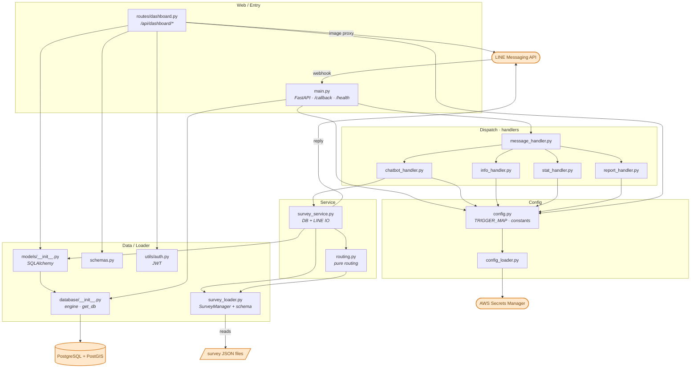

# Architecture — Component Map (A)

> **อ่านยังไง:** กล่อง = 1 ไฟล์ `.py` · กล่องสีส้ม = ระบบภายนอก (ของนอก ไม่ใช่โค้ดเรา)
> ระบบมี **2 ซีกที่แทบไม่คุยกัน** — ตามได้จากจุดเริ่ม 2 จุด:
> - **ซีก Survey** เริ่มที่ `main.py` (รับ LINE webhook)
> - **ซีก Dashboard** เริ่มที่ `routes/dashboard.py` (REST API ให้แอดมิน)
>
> จุดร่วมเดียว = ทั้งคู่แตะ **DB เดียวกัน** และ **LINE เดียวกัน** (survey รับ/ตอบ, dashboard ดึงรูป)

## โซน (layers)

| โซน | ไฟล์ | หน้าที่ |
|---|---|---|
| **Web / Entry** | `main.py`, `routes/dashboard.py` | จุดรับเข้า — webhook ของ LINE และ REST API ของแอดมิน |
| **Dispatch** | `message_handler` + `info/stat/report/chatbot_handler` | แยกข้อความตามปุ่ม Rich Menu / trigger word |
| **Service** | `survey_service` (มี IO), `routing` (pure) | state machine ของ survey — ตัดสินใจคำถามถัดไป |
| **Data / Loader** | `survey_loader`, `models`, `database`, `schemas`, `auth` | สคีมา survey, ตาราง DB, JWT |
| **Config** | `config`, `config_loader` | env / trigger map / โหลด secrets |
| **External** | LINE API, PostgreSQL+PostGIS, AWS Secrets Manager, JSON | ของนอกระบบ |
